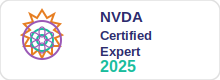

# URL Announcer Add-on for NVDA

Gives blind and visually impaired users fast, accessible control over the current browser URL — announce it, copy it, share it, bookmark it, and more — all from a single keyboard shortcut.

---

## Author

<table>
<tr>
<td></td>
<td>

**Tirupati Janardhan Gaikwad**  
📧 ytirupatiygaikwad@gmail.com  
📞 +91 99757 32046

</td>
<td>

<a href="https://certification.nvaccess.org/?query=tirupati&country=IN&submit=Search">

</a>

**[✅ Verify my NVDA Certification](https://certification.nvaccess.org/?query=tirupati&country=IN&submit=Search)**

</td>
</tr>
</table>

---

## License

GPL-2.0 &nbsp;|&nbsp; **NVDA compatibility:** 2021.1 and later

---

## Download

Download the latest release from the **[Releases page](https://github.com/tirupati223/urlAnnouncer/releases)**.

Direct download: [urlAnnouncer-3.0.0.nvda-addon](https://github.com/tirupati223/urlAnnouncer/releases/download/v3.0.0/urlAnnouncer-3.0.0.nvda-addon)

---

## How to Use

Press **NVDA+Shift+U** to open the command layer. NVDA speaks the available commands. Then press one letter:

| Key | Action |
|-----|--------|
| `A` | Announce current URL |
| `C` | Copy URL to clipboard |
| `S` | Copy share link (YouTube → short youtu.be link) |
| `X` | Security status (HTTPS / HTTP / local file) |
| `W` | Share menu — WhatsApp, Facebook, Telegram, Gmail, Twitter, LinkedIn |
| `R` | Browse URL history (last 10 URLs this session) |
| `M` | Save current URL as a bookmark |
| `B` | Browse saved bookmarks |
| `L` | Shorten URL using TinyURL |
| `T` | Announce page title and URL together |
| `E` | Open email client with URL pre-filled |
| `O` | Open URL in a chosen browser |
| `P` | Read URL from clipboard |
| `D` | Domain safety analysis |
| `Q` | Generate QR code (opens in browser) |
| `H` | Repeat all commands |
| `Escape` | Cancel |

> **Why NVDA+Shift+U?**  
> `NVDA+U` (without Shift) is a built-in NVDA command for navigating to the next unvisited link.  
> `NVDA+Shift+U` is free of all conflicts.  
> You can change it anytime: **NVDA Menu → Preferences → Input Gestures → URL Announcer**

---

## Settings

**NVDA Menu → Preferences → Settings → URL Announcer**

| Setting | Default |
|---------|---------|
| Speak URL in readable chunks (Protocol / Domain / Path / Parameters) | Off |
| Include page title when announcing URL | Off |
| Automatically announce URL when a new page loads | Off |
| Restore clipboard after reading URL | On |
| URL history size (5 / 10 / 20 / 50) | 10 |
| Extended domain safety analysis | Off |
| Check for updates on NVDA startup | On |

---

## Supported Browsers

Chrome · Edge · Firefox · Opera · Brave · Vivaldi · Internet Explorer · Waterfox · SeaMonkey · Pale Moon

---

## Installation

1. Download `urlAnnouncer-3.0.0.nvda-addon` from [Releases](https://github.com/tirupati223/urlAnnouncer/releases)
2. Double-click the file
3. Click **Yes** when NVDA asks to install
4. Restart NVDA
5. Open any browser and press **NVDA+Shift+U**

---

## Building from Source

```bash
git clone https://github.com/tirupati223/urlAnnouncer.git
cd urlAnnouncer
python build.py
```

Output: `C:\Temp\urlAnnouncer-3.0.0.nvda-addon`

---

## Changelog

### 3.0.0
- URL history (R), bookmarks save/browse (M/B)
- URL shortener via TinyURL (L), QR code (Q)
- Page title + URL (T), email URL (E), open in chosen browser (O)
- Read clipboard URL (P), domain safety analysis (D)
- Settings panel in NVDA Preferences
- Readable URL mode (Protocol / Domain / Path / Parameters)
- Auto-announce on page load (opt-in)
- Firefox retry loop for reliable URL reading
- Background update notifications
- 7-module professional architecture

### 2.0.0
- Command layer with NVDA+Shift+U
- Announce (A), copy (C), share link (S), security (X), share dialog (W)
- YouTube short links, HTTPS/HTTP detection
